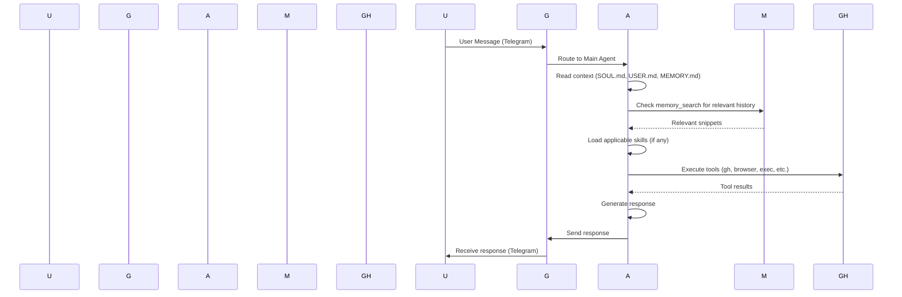

<!-- _class: lead -->

# OpenClaw: Good, Bad & How I Actually Use It

## Architecture, Memory System, and Practical Usage

Vishnu KS | @iamvishnuks

---

<!-- _class: lead -->

# Agenda

1. **What is OpenClaw?**
2. **Architectural Overview**
3. **How to Give Instructions to Agents**
4. **How OpenClaw Memorizes Everything**
5. **Live Demo**
6. **Good, Bad & Practical Usage**
7. **Q&A**

---

# Section 1: What is OpenClaw?

OpenClaw is a self-hosted AI agent orchestration platform.

## Core Philosophy

- **Run anywhere:** Docker, bare metal, edge devices
- **Full control:** Your data, your models, your infrastructure
- **Extensible:** Skills, tools, channels, agents
- **Proactive:** Agents can initiate actions, not just respond

---

# What Makes OpenClaw Different?

| Aspect | Traditional AI | OpenClaw |
|--------|---------------|----------|
| **Hosting** | SaaS, third-party | Self-hosted, your infra |
| **Data Privacy** | Vendor-controlled | Fully yours |
| **Extensibility** | Limited | Unlimited (skills, tools) |
| **Channels** | Web/app only | Telegram, WhatsApp, Discord, and more |
| **Agent Behavior** | Reactive only | Reactive + proactive |
| **Memory** | Session-only | Persistent, searchable (RAG) |

---

# Use Cases

- **Home Automation:** Control smart devices, monitor services
- **Code Review:** PR reviews, security audits, CI monitoring
- **System Administration:** SSH, Docker, Kubernetes operations
- **Personal Assistant:** Calendar, reminders, research
- **Integration Hub:** Connect multiple services and APIs

---

<!-- _class: lead -->

# Section 2: Architectural Overview

---

# High-Level Architecture

```
┌─────────────────────────────────────────────────────────┐
│                     Channels                           │
│  ┌────────┐ ┌──────────┐ ┌────────┐ ┌──────────┐  │
│  │Telegram│ │WhatsApp  │ │Discord │ │   HTTP   │  │
│  └────┬───┘ └────┬─────┘ └────┬───┘ └────┬─────┘  │
│       │          │           │          │          │
└───────┼──────────┼───────────┼──────────┼──────────┘
        │          │           │          │
        ▼          ▼           ▼          ▼
┌─────────────────────────────────────────────────────────┐
│                   Gateway                              │
│  • Authentication                                       │
│  • Message routing                                     │
│  • Session management                                  │
│  • Node orchestration                                 │
└────────────────┬────────────────────────────────┘
                         │
                         ▼
┌─────────────────────────────────────────────────────────┐
│                   Agents                               │
│  ┌──────────┐ ┌──────────┐ ┌──────────┐           │
│  │  Main    │ │ Subagent │ │  Special  │           │
│  └────┬─────┘ └────┬─────┘ └────┬─────┘           │
│       │            │            │                     │
│       └────────────┼────────────┘                     │
│                    ▼                                 │
│           ┌─────────────────┐                         │
│           │   Tools        │                         │
│           │  • exec        │                         │
│           │  • browser     │                         │
│           │  • web_search  │                         │
│           │  • message     │                         │
│           └─────────────────┘                         │
└──────────────────┬──────────────────────────────────────┘
                   │
                   ▼
┌─────────────────────────────────────────────────────────┐
│                    Skills                              │
│  • github  • healthcheck  • weather                   │
│  • canvas  • coding-agent  • (custom...)               │
└─────────────────────────────────────────────────────────┘
```

---

# Components Deep Dive

## Gateway
- **Port:** Configurable (default: 18789)
- **Auth:** Token-based, supports Tailscale
- **Binding:** loopback, public, or node-hosted
- **Node Management:** Register and control remote devices

## Agents
- **Main Agent:** Primary conversation handler
- **Subagents:** Background workers for parallel tasks
- **Special Agents:** Different models or configurations
- **Isolation:** Each agent has its own context and tools

## Tools
- **Built-in:** exec, browser, web_search, web_fetch, message, etc.
- **Extensible:** Add custom tools via skills
- **Sandboxing:** Can run in container or on host

---

# Skills System

```
/app/skills/
├── github/
│   └── SKILL.md (instructions + examples)
├── healthcheck/
│   └── SKILL.md
├── weather/
│   └── SKILL.md
└── your-custom-skill/
    ├── SKILL.md
    ├── script.sh
    └── resources/
```

**When to use a skill:**
- Task matches skill description exactly
- Need specialized workflows or tooling
- Want reusable patterns across agents

**How I detect skills:**
- Match task description to skill metadata
- Auto-load SKILL.md when applicable
- Follow skill instructions precisely

---

# Data Flow Example



---

<!-- _class: lead -->

# Section 3: How to Give Instructions to Agents

---

# Instruction Methods

## Method 1: Workspace Files (Recommended)

Permanent, loaded at every session startup.

| File | Purpose | Example Content |
|------|---------|----------------|
| `AGENTS.md` | Workspace rules, memory workflow | "Read these files every session" |
| `SOUL.md` | Agent personality, behavior | "Be casual, proactive, no fluff" |
| `USER.md` | User context, preferences | "Timezone: IST, call me Vishnu" |
| `HEARTBEAT.md` | Proactive checklist | "Check services, email, calendar" |
| `MEMORY.md` | Long-term curated memory | "Decisions, lessons learned" |

---

## Method 2: SKILL.md

For repeatable tasks or specialized workflows.

```markdown
---
name: code-review
description: Review code for security, best practices, bugs
---

# Code Review Skill

## Workflow
1. Read the code files
2. Check for security issues
3. Suggest improvements
4. Provide line-by-line feedback

## What to Check
- Security vulnerabilities
- Code smells
- Best practices
- Documentation
```

---

## Method 3: Direct Instructions

Per-conversation commands.

**Examples:**
- "Review this PR and focus on security"
- "Be concise, no fluff"
- "Use memory_search before answering"

**Pros:** Immediate, flexible
**Cons:** Not persistent across sessions

---

## Method 4: Memory Files

Captured during conversations.

```
memory/
├── 2026-02-20.md  (yesterday's log)
├── 2026-02-21.md  (today's log)
└── ...
```

When I say "write it down", I update:
- `memory/YYYY-MM-DD.md` — raw logs
- `MEMORY.md` — distilled wisdom

---

# Good vs Bad Instructions

## ❌ Bad Instructions
- "Be nice" (too vague)
- "Review my code" (no focus area)
- "Do whatever you want" (no constraints)
- Long, rambling descriptions

## ✅ Good Instructions
- "Be casual and direct, skip fluff"
- "Review Terraform for security issues: exposed ports, secrets, IAM"
- "Use memory_search before answering about prior decisions"
- "Alert only if services go down, stay silent otherwise"

---

# Example: SOUL.md

```markdown
# SOUL.md - Who You Are

## Core Truths
- Be genuinely helpful, not performatively helpful
- Have opinions — don't be a search engine
- Be resourceful before asking
- Take initiative — fix things without being asked

## Boundaries
- Private things stay private
- Ask before acting externally
- Never send half-baked replies

## Vibe
Casual, practical, capable. Like a competent colleague.
```

---

# Example: HEARTBEAT.md

```markdown
# HEARTBEAT.md

## Proactive Checks

### Self-hosted Services
- Service monitoring script runs hourly
- Nextcloud: https://cloud.iamvishnuks.com
- Immich: https://immich.iamvishnuks.com

### Code & Infrastructure
- Terraform drift detection
- Python code review queue
- Security updates available?

## Notes
- Timezone: India/Kerala (UTC+5:30)
- Respect quiet hours: 23:00-08:00
```

---

<!-- _class: lead -->

# Section 4: How OpenClaw Memorizes Everything

---

# Memory Architecture

```
Session Start
      │
      ▼
Load Context Files
├── SOUL.md (who am I?)
├── USER.md (who are you?)
├── HEARTBEAT.md (what to check)
└── MEMORY.md (long-term memory)
      │
      ▼
Load Recent Logs
├── memory/YYYY-MM-DD.md (today)
└── memory/YYYY-MM-DD.md (yesterday)
```

**Result:** Agent wakes up with full continuity.

---

# Two Types of Memory

## 1. Daily Logs (`memory/YYYY-MM-DD.md`)

**Purpose:** Raw, day-by-day records like a journal

**Captured:**
- Conversations and decisions
- Actions taken
- Context for future reference

**Example:**
```markdown
# 2026-02-21

## Setup
- Vishnu onboarded me as "Yiti"
- Set up gh CLI authentication

## Conversations
- Discussed repo priorities
- Decided to monitor services hourly
```

---

## 2. Long-Term Memory (`MEMORY.md`)

**Purpose:** Curated, distilled wisdom

**Captured:**
- Preferences and rules
- Decisions worth keeping
- Lessons learned
- Context that matters long-term

**Example:**
```markdown
## Preferences
- Casual communication, no pressure
- Proactive but not annoying

## Decisions
- Use direct methods over subagents for most tasks
- Alert only if services go down

## Lessons Learned
- Always check local files before web search
- Use memory_search for context questions
```

---

# RAG Implementation

## Retrieval

When you ask about prior work, decisions, or preferences:

```
memory_search(
  query: "What did Vishnu say about monitoring?",
  maxResults: 5,
  minScore: 0.7
)
```

**What happens:**
- Embeds your query → vector
- Semantic search across memory files
- Returns ranked snippets with paths
- I read only what's needed

---

## Augmentation & Generation

**Step 1:** Retrieve relevant snippets

**Step 2:** Read specific lines only
```javascript
memory_get(path: "memory/2026-02-21.md", from: 10, lines: 5)
```

**Step 3:** Generate answer based on retrieved context

---

# Why This Matters

## Benefits

| Aspect | Traditional Approach | OpenClaw RAG |
|--------|-------------------|--------------|
| **Context Loading** | Read everything every time | Retrieve only what's relevant |
| **Token Efficiency** | Waste on irrelevant data | Read specific lines |
| **Accuracy** | Guess context | Semantic search finds exact matches |
| **Privacy** | Everything in prompt | MEMORY.md only in private sessions |

## Key Principle

"I wake up fresh each session. These files ARE my continuity."

---

<!-- _class: lead -->

# Section 5: Live Demo

---

# Demo Scenario

**Task:** PR Review via Telegram

**Repository:** `eks-tf` (Terraform for EKS cluster)

**Workflow:**
1. User sends Telegram message
2. I retrieve the PR
3. Review Terraform code for:
   - Security issues
   - Best practices
   - Potential bugs
4. Provide structured feedback
5. Post comments to PR

---

# Demo Steps

```
┌──────────────────────────────────────┐
│ 1. User (Telegram)                  │
│    "Review PR #42 in eks-tf"         │
└──────────────┬───────────────────────┘
               │
               ▼
┌──────────────────────────────────────┐
│ 2. Gateway                          │
│    Route to Yiti agent              │
└──────────────┬───────────────────────┘
               │
               ▼
┌──────────────────────────────────────┐
│ 3. Yiti Agent                       │
│    • Check gh authentication        │
│    • Fetch PR #42                   │
│    • Read Terraform diffs          │
│    • Analyze code                  │
│    • Generate review               │
└──────────────┬───────────────────────┘
               │
               ▼
┌──────────────────────────────────────┐
│ 4. GitHub                          │
│    Post review comments             │
└──────────────┬───────────────────────┘
               │
               ▼
┌──────────────────────────────────────┐
│ 5. User (Telegram)                  │
│    Receive review summary            │
└──────────────────────────────────────┘
```

---

<!-- _class: lead -->

# Section 6: Good, Bad & Practical Usage

---

# What OpenClaw Excels At

## ✅ Strong Points

| Use Case | Why It Works |
|----------|-------------|
| **Self-hosted services monitoring** | Proactive alerts, can run scripts |
| **Code review** | GitHub integration, can read/write files |
| **Infrastructure automation** | Full access to Docker, K8s, SSH |
| **Personal assistant** | Persistent memory, multiple channels |
| **Integration tasks** | Connects disparate services |

**Why:** You own the infrastructure, data, and can extend infinitely.

---

# Common Pitfalls

## ❌ Don't Do This

| Mistake | Why It's Bad |
|---------|--------------|
| **Over-token usage** | Agent keeps re-reading files |
| **Unclear instructions** | Agent guesses, makes mistakes |
| **No memory discipline** | Forgets important context |
| **Skipping skills** | Re-implementing what exists |
| **Over-using subagents** | Costly, unnecessary complexity |

---

## ❌ Real Stories

**"It keeps repeating itself"**
- Cause: No proper memory usage
- Fix: Update MEMORY.md with decisions

**"It's too verbose"**
- Cause: Vague instructions
- Fix: Add "be concise" to SOUL.md

**"It costs too much"**
- Cause: Always using high-end models
- Fix: Use Flash for simple tasks, main for complex ones

---

# Best Practices

## 🏆 Pro Tips

1. **Write it down** — Files persist, mental notes don't
2. **Use skills** — Don't re-implement workflows
3. **Be specific** — Clear instructions = better results
4. **Leverage RAG** — memory_search first, then answer
5. **Model selection** — Match model to task complexity
6. **Batch operations** — Combine checks into one cron job
7. **Security first** — Restrict dangerous tools, review code

---

# Real-World Examples

## Example 1: Service Monitoring

**Setup:**
- Created `monitor-services.sh`
- Added to cron: hourly checks
- Alerts only on failure

**Result:**
- Silent when healthy
- Immediate alert when down
- Zero false positives

---

## Example 2: Code Review Workflow

**Instructions in SOUL.md:**
```
When reviewing Terraform:
- Check for security: exposed ports, secrets, IAM
- Flag bad practices: hardcoding, version pinning
- Suggest improvements with examples
- Be direct, no fluff
```

**Result:**
- Consistent reviews
- Better security posture
- Saves manual review time

---

## Example 3: Memory-Driven Decisions

**Scenario:** "How should we approach Kubernetes upgrades?"

**My process:**
```
1. memory_search("kubernetes upgrade decision")
2. Read MEMORY.md → "Use rolling updates, test in staging"
3. Check platform-k8s-config repo
4. Provide aligned recommendation
```

**Result:**
- Consistent with prior decisions
- No contradictory advice
- Leverages institutional knowledge

---

# When to Use OpenClaw

## ✅ Good Fit

| Situation | Reason |
|-----------|--------|
| You own your infra | Full control, no vendor lock-in |
| Privacy matters | Data never leaves your systems |
| Need proactivity | Agents can initiate, not just respond |
| Custom workflows | Skills + tools = unlimited extension |
| Multiple channels | Telegram, WhatsApp, Discord in one place |

---

# When NOT to Use OpenClaw

## ❌ Wrong Fit

| Situation | Reason |
|-----------|--------|
| Quick, one-off questions | ChatGPT is easier |
| Need SaaS convenience | OpenClaw requires self-hosting |
| No technical resources | Need infra knowledge |
| Want pre-built agents | OpenClaw is DIY |
| Browser-only usage | Better tools for simple chat |

---

<!-- _class: lead -->

# Section 7: Q&A

---

# Questions?

Topics we covered:

1. ✅ OpenClaw architecture
2. ✅ Instruction methods
3. ✅ Memory system (RAG)
4. ✅ Live demo workflow
5. ✅ Best practices

---

# Resources

- **Docs:** https://docs.openclaw.ai
- **Source:** https://github.com/openclaw/openclaw
- **Community:** https://discord.com/invite/clawd
- **Skills:** https://clawhub.com
- **This repo:** github.com/iamvishnuks/openclaw-talk

---

# Thank You!

### Vishnu KS

**@iamvishnuks**

---

<!-- _class: lead -->

# Appendix: Quick Reference

## Core Commands

```bash
# Gateway management
openclaw gateway status
openclaw gateway start
openclaw gateway stop

# Cron jobs
openclaw cron list
openclaw cron add --name task --schedule "0 * * * *" --command "/path/to/script"

# Security
openclaw security audit --deep
openclaw security audit --fix

# Updates
openclaw update status
```

## Essential Files

| File | Purpose | Updated When |
|------|---------|--------------|
| `AGENTS.md` | Startup rules | Rarely |
| `SOUL.md` | Personality | As you evolve |
| `USER.md` | User context | When preferences change |
| `HEARTBEAT.md` | Proactive checks | As needs evolve |
| `MEMORY.md` | Long-term memory | Periodically (every few days) |
| `memory/YYYY-MM-DD.md` | Daily logs | Every session |

---

# End

---
